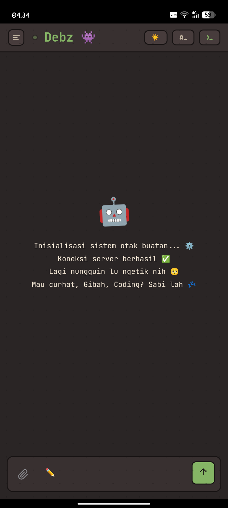
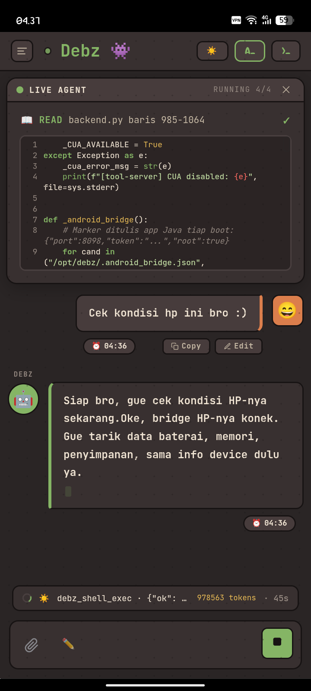
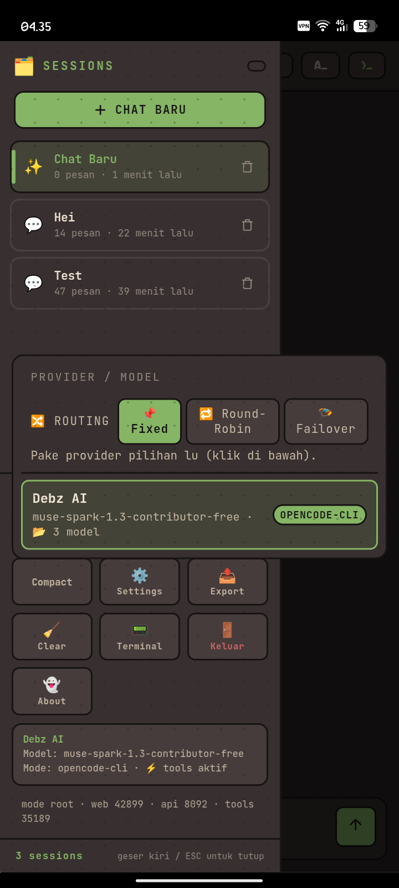
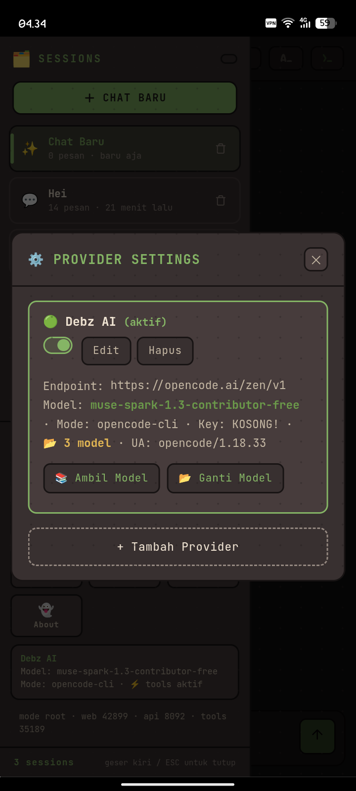
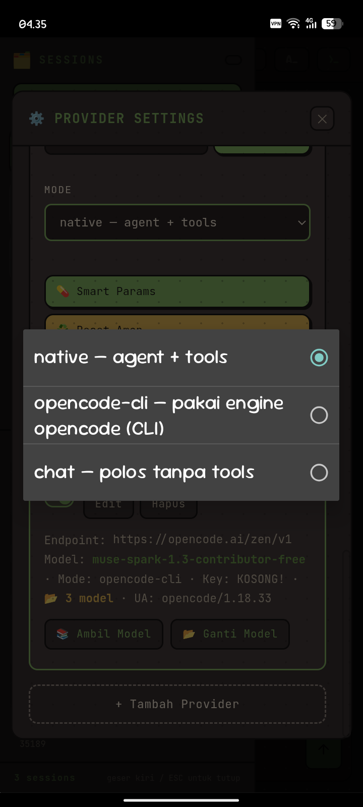
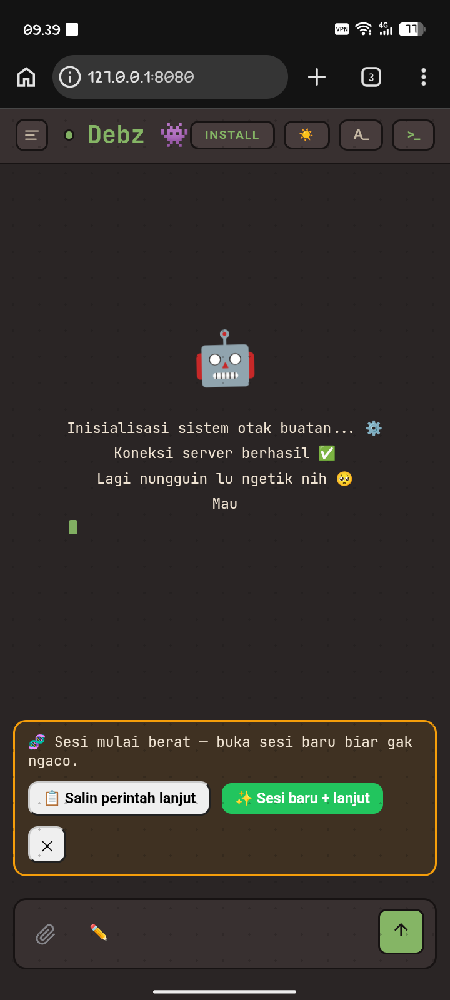

# DebzAI — Asisten AI Mobile untuk Android (Hybrid APK)

[](LICENSE)
[](app/)
[](rootfs/)
[](https://github.com/debzroot/debz-ai-apk/releases/tag/ci-latest)
[](https://github.com/debzroot/debz-ai-apk/stargazers)

> ⭐ **Kalau project ini berguna, kasih Star ya — biar makin semangat maintain!**
> Klik ⭐ di kanan atas repo ini. Gratis, tapi ngaruh banget.

**DebzAI** adalah asisten AI mobile opensource khusus Android: APK native ringan yang membawa
agent AI langsung di HP — bisa ngoding, eksekusi tool, otomatisasi, dan akses sistem —
tanpa perlu VPS atau API key mahal.

> Install → buka → langsung chat. Rootfs-mini (~130MB) terbundle di APK, backend
> (php-fpm + nginx + opencode serve) jalan lokal di HP via proot.

---

## Kegunaan APK ini

- **Asisten ngoding di HP**: baca/tulis/edit file, cari kode, jalankan shell, git, build.
- **Agent otonom mobile**: tool calling (shell, file, HTTP, SQLite, arsip, proses,
  scheduler, backup), browser automation (CDP), kendali layar virtual (CUA).
- **Akses sistem Android**: via Android Bridge (root) — `pm`, `dumpsys`, `settings`,
  `input tap`, dsb. — plus WebView, terminal, dan foreground service agar backend tetap hidup.
- **Hemat & stabil**: provider opencode-cli tanpa API key (session per-device),
  routing multi-provider dengan **failover otomatis ala 9Router** (provider chain,
  retry + backoff, semua direct tanpa proxy).
- **Update gampang**: tiap ada `ROOTFS_EPOCH` baru, app wipe + extract ulang otomatis.
  Update kode app-layer via OTA dari GitHub Releases (`ci-latest`).

## Fitur utama

- **Hybrid engine**
  - `opencode` binary (`sst/opencode`, ARM64) — `run` / `serve`, session, tool use.
  - Native PHP agent (`backend/agent.php`, `debz-term.py`) — planner → worker → verifier,
    circuit breaker, prompt manager DB-driven, stats dashboard.
- **Failover seperti 9Router**
  - Provider chain + circuit breaker + retry ber-backoff, semua request direct.
  - Failover saat 5xx / timeout / limit / stall, auto-handoff sesi berat.
- **Tools lengkap** (22 via `backend.py`): exec, fs read/write/list/search, http,
  download, db, archive, ps/kill, skill, note (memori `notes.db`), pkg, web_search,
  backup, scheduler (cron), computer_use, browser, screenshot, rag.
- **AllowAll yang beneran auto**: toggle sidebar persist (`.approval_always`),
  Tools ON default + persist `localStorage`, `--auto` ikut ON saat AllowAll aktif.
  Tidak ada lagi approval hidden yang bikin agent diam.
- **Agent cepat paham**: `backend/AGENTS.md` canonical + auto-seed `notes.db`
  (`bootstrap`, `map-apk`, `rules-core-ai`, `tools-cheatsheet`) — agent langsung
  tahu peta tool tanpa `glob`/`grep` berulang.
- **Native Android**: WebView + Terminal + `BootstrapService`, `PortManager`
  (anti-bentrok port), `RootDetector`, `OtaManager` (poll `ci-latest`), `RootfsManager`
  (`ROOTFS_EPOCH`), `BridgeServer` (eksekusi root).

## Arsitektur singkat

```text
debz-ai-apk/
├── app/                                # Native Android (Java)
│   └── src/main/java/ai/debz/
│       ├── MainActivity.java           # WebView + UI utama
│       ├── TerminalActivity.java       # Terminal proot
│       ├── BootstrapService.java       # Foreground service
│       ├── StackSupervisor.java        # Orchestrator stack backend
│       ├── PortManager.java            # Port dinamis anti-bentrok
│       ├── RootfsManager.java          # Extract + ROOTFS_EPOCH wipe
│       ├── ProotManager.java           # Lifecycle proot-mini
│       ├── OtaManager.java             # Poll OTA ci-latest
│       ├── RootDetector.java           # Deteksi root
│       ├── BridgeServer.java           # Eksekusi root (8098)
│       ├── DebzConfig.java             # Konstanta config
│       └── ...
├── backend/                            # PHP + Python (jalan di proot /opt/debz/app)
│   ├── index.php                       # WebUI (login 1337)
│   ├── c0n73xt.js / c0n73xt.css        # Frontend chat + sidebar Tools/AllowAll
│   ├── agent.php                       # Planner → worker → verifier
│   ├── agent-helpers.php               # Helper agent
│   ├── api.php                         # REST /api/* (WebUI ↔ backend)
│   ├── providers.php                   # Provider chain + failover
│   ├── debz-term.py                    # Orkestrator opencode-cli (RULES WAJIB)
│   ├── backend.py                      # 22 tools Flask (:tools dinamis)
│   ├── debz_tools_mcp.py               # MCP server (shell/file/browser)
│   ├── cua_driver.py + cua_mcp.py      # Layar virtual (computer_use)
│   ├── browser.py + cdp_chrome.py      # Browser automation (CDP)
│   ├── skills/*/SKILL.md               # Skill modular
│   ├── AGENTS.md                       # Canonical agent (single source of truth)
│   └── opencode-bin/
│       └── .cfg_home/opencode/
│           └── opencode.jsonc          # Config + instructions
├── rootfs/                             # Builder rootfs-mini.tar.gz (~130MB)
│   ├── build-rootfs.sh                 # ubuntu-base ARM64 + php/nginx/python
│   ├── fetch-arm64-debs.py             # Fetch .deb ARM64
│   └── opt-debz/                       # Payload → /opt/debz di HP
└── .github/workflows/build.yml         # CI: rootfs → APK → Release ci-latest
```

Alur runtime di HP:

```text
APK dibuka
  └─► RootfsManager (cek EPOCH → extract bila perlu)
        └─► BootstrapService + StackSupervisor
              ├── php-fpm (backend/*.php)
              ├── nginx (WebUI :web dinamis)
              ├── backend.py (tools :tools dinamis)
              └── opencode serve (:api 8092)
                    └─► WebView ↔ WebUI ↔ agent ↔ tools ↔ BridgeServer (root)
```

- `backend/` di-copy ke `$ROOTFS/opt/debz/app` saat build (lihat `rootfs/build-rootfs.sh` langkah 6).
- `opencode` config isolasi di `backend/opencode-bin/.cfg_home` (jangan dihapus).
- Port dinamis via `PortManager`, tercatat di `.ports.json` (jangan asumsi `9191`/`8091` tetap).

## Cara pakai

1. Install APK dari [Releases](https://github.com/debzroot/debz-ai-apk/releases/tag/ci-latest) (`ci-latest` = build terbaru `main`).
2. Buka app → rootfs extract otomatis → stack up (php-fpm + nginx + opencode serve).
3. Login WebUI password `1337` → chat langsung jalan.
4. Sidebar: **Tools ON** (agent bisa shell/file/search) + **AllowAll ON** (tanpa approval).

## Galeri

| Chat siap | Live Agent ngoding | Sessions + Routing |
|---|---|---|
|  |  |  |
| Chat langsung jalan di HP | Agent baca file + eksekusi tool | Fixed / Round-Robin / Failover |

| Provider Settings | Mode Selector | Chat Home |
|---|---|---|
|  |  |  |
| Ganti model tanpa API key | native / opencode-cli / chat polos | Install → buka → langsung chat |

## Build & CI

- CI (`.github/workflows/build.yml`): job `rootfs` → job `android` (needs).
  Tiap push `main` → build rootfs + APK → upload ke Release rolling `ci-latest`.
- Alur dev: **HP dulu, GH ngikut** — oprek + verifikasi di rootfs HP,
  yang sudah terbukti baru di-commit/push. Naikkan `ROOTFS_EPOCH`
  (`app/.../RootfsManager.java`) tiap ada perubahan backend tak-kompatibel.

```sh
# build rootfs lokal
./rootfs/build-rootfs.sh
# APK via Android Studio / gradle
./gradlew assembleRelease
```

## Terinspirasi oleh

- [opencode](https://github.com/sst/opencode) — AI coding agent untuk terminal.
- [9Router](https://github.com/decolua/9router) — smart router multi-provider dengan round-robin + auto-fallback.
- [Hermes Agent](https://github.com/NousResearch/hermes-agent) — autonomous AI agent dengan persistent memory oleh Nous Research.

## Dukung developer

Kalau APK ini ngebantu kerja mobile kamu, traktir kopi biar lanjut stabil:

<p align="center">
  <a href="https://saweria.co/debzroot" target="_blank">
    
  </a>
</p>

<p align="center">
  <a href="https://github.com/debzroot/debz-ai-apk/stargazers">
    
  </a>
  <br />
  <sub>⭐ Jangan lupa kasih <b>Star</b> kalau project ini berguna — 1 klik, bikin maintain makin rajin update.</sub>
</p>

## Lisensi

[MIT License](LICENSE) — bebas pakai, ubah, dan distribusi. Lihat file `LICENSE`.
